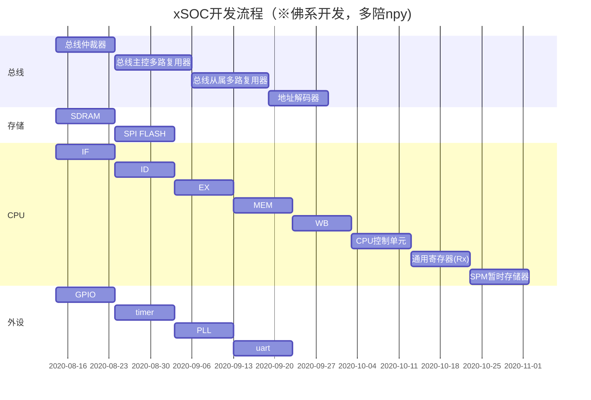

# xSOC简介
基于RISC架构的32位SOC，xdd_core于2020.8.14正式开始捏。
平台：Intel Cyclone IV EP4CE15F23C8N
### 目标汇总及进度
- [x] 总线部分
- [x] CPU部分
- [x] 存储部分
- [x] 外设部分
- [x] SOC顶层
- [x] 简易汇编编译器搭建
- [x] 点亮LED灯
- [x] 串口打印“Hello,World!”

# 特性:
1. 五级流水线
2. 涵盖7大类的28条指令作为指令集:逻辑运算指令，算术运算指令，移位指令，分支指令，特殊指令，特权指令。
3. 32MB SDRAM
4. 更多特性，等待后面慢慢捏

# 系统蓝图
├── chip_top         // 顶层测试
——├── clk_gen     //时钟模块     
——├── chip        // SOC顶层
——├── cpu     // cpu顶层
——├── ROM     // ROM顶层
——├── RAM     // RAM顶层
——├── timer   // 定时器顶层
——├── uart    // uart顶层
——├── gpio    // gpio顶层
——├── bus     // 总线顶层

# 时间节点规划

